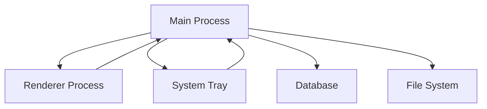

# Personyx 🎯

**Persona-based evidence analysis for product requirements**

Personyx is a desktop application that prevents wasted engineering sprints by demanding real-user evidence for every Product Requirements Document (PRD). It ingests customer interview transcripts, analyzes them for persona patterns, and provides actionable insights directly in your development workflow.

[]()
[]()
[]()
[]()

## 🚀 Quick Start

### Run Personyx Locally

```bash
# Install dependencies
pnpm install

# Start development mode (hot reload)
pnpm dev

# Build for production
pnpm build

# Package for distribution
pnpm dist
```

## Development Workflow

### 1. ✅ Install Dependencies

```bash
# Install all workspace dependencies
pnpm install
```

### 2. ✅ Start Development Server

```bash
# Concurrent development with hot reload
pnpm dev

# This runs:
# - TypeScript compiler for main process (watch mode)
# - Vite dev server for renderer process
# - Electron app with live reload
```

### 3. ✅ Open Personyx in Electron when ready

The app will automatically open when the build completes. Look for:

- 🎯 System tray icon (right-click for menu)
- 📱 Tray menu with "Import PRD" option

## Architecture

### Core Structure

Personyx uses a **monorepo architecture** with clear separation between processes:

```
Personyx/
├── src/
│   ├── main/           # Electron main process (Node.js)
│   ├── renderer/       # React UI (Chromium)
│   └── shared/         # Shared types & constants
├── dist/               # Compiled output
└── release/            # Distribution packages
```

### Process Communication



## Features

### ✅ Phase 1 - Foundation (Complete)

- [x] **Electron 28 + TypeScript** - Cross-platform desktop app
- [x] **React 18 + Tailwind CSS** - Modern UI with design system
- [x] **System Tray** - Native desktop integration
- [x] **File Import** - PRD document processing
- [x] **Auto-update** - Seamless updates
- [x] **Development Tools** - Hot reload, type safety, linting

### 🔄 Phase 2 - Data Layer (Partially Complete)

- [x] **SQLite Database** - Local evidence storage with encryption
- [x] **Encryption** - Secure API token management with AES-256
- [x] **Persona Classification** - AI-powered analysis via LangGraph
- [ ] **Evidence Scoring** - Quantified risk assessment

### 🔄 Phase 3 - Interface Layer (Planned)

- [ ] **VS Code Extension** - IDE integration
- [ ] **Slack Bot** - Team notifications
- [ ] **Notion Integration** - Documentation sync
- [ ] **Linear Labeling** - Automated ticket tagging

## Design System

Personyx implements the **Evidence Gate Design System** with:

- **Colors**: Evidence Blue, Persona Green, Insight Violet
- **Typography**: Inter font family with semantic scales
- **Components**: Cards, buttons, forms, notifications
- **Spacing**: 4px grid system with semantic tokens
- **Motion**: Purposeful animations for feedback

## Development

### Build System

```bash
# TypeScript compilation
pnpm build:main      # Main process
pnpm build:renderer  # Renderer process
pnpm build          # Both processes

# Development
pnpm dev            # Hot reload both processes
pnpm dev:main       # Main process only
pnpm dev:renderer   # Renderer process only

# Quality
pnpm lint           # ESLint
pnpm type-check     # TypeScript validation
pnpm security       # Security scan
```

### Code Quality

- **TypeScript**: Strict mode with comprehensive type checking
- **ESLint**: Consistent code style and error prevention
- **Prettier**: Automated code formatting
- **Husky**: Pre-commit hooks for quality gates

## Technology Stack

### Core

- **Electron 28** - Cross-platform desktop framework
- **TypeScript 5.3** - Type-safe JavaScript
- **React 18** - Component-based UI
- **Tailwind CSS 3+** - Utility-first styling

### Tooling

- **Vite 5** - Fast development server
- **pnpm** - Efficient package management
- **ESLint + Prettier** - Code quality
- **Electron Builder** - Application packaging

## Project Goals

Personyx aims to save teams **1.5+ engineering sprints per month** by rejecting low-evidence features and surfacing persona-specific insights directly in development tools.

### Success Metrics

- **25%+ features rejected** before development
- **80+ evidence score** average for shipped features
- **1.5+ sprints saved** per month per team

## 🛠️ Architecture

PersonaPulse uses a **monorepo architecture** with clear separation between processes:

```
Personyx/
├── src/
│   ├── main/           # Core Process (Electron Main)
│   │   ├── main.ts     # App initialization & IPC handlers
│   │   ├── tray.ts     # System tray management
│   │   └── utils/      # Logging & utilities
│   ├── renderer/       # Tray UI (Electron Renderer)
│   │   ├── App.tsx     # React application
│   │   ├── main.tsx    # React entry point
│   │   └── styles/     # Tailwind CSS + design system
│   └── shared/         # Shared Types & Constants
│       ├── types.ts    # TypeScript interfaces
│       └── constants.ts # IPC channels & app constants
├── docs/               # Documentation
├── memory_bank/        # Project context & progress
└── [configs]          # Build & development configurations
```

### 🔄 **Process Communication**

- **Main Process**: Business logic, file system access, database operations
- **Renderer Process**: React UI for evidence analysis and persona chat
- **IPC Layer**: Type-safe communication via Electron's IPC system

## 🛠️ Technology Stack

### **Core Framework**

- **[Electron 28](https://electronjs.org/)** - Cross-platform desktop apps
- **[TypeScript 5.3+](https://typescriptlang.org/)** - Type-safe development
- **[Node.js 20](https://nodejs.org/)** - Runtime environment

### **Frontend (Renderer Process)**

- **[React 18](https://react.dev/)** - UI framework
- **[Vite 5](https://vitejs.dev/)** - Fast build tool and dev server
- **[Tailwind CSS 3+](https://tailwindcss.com/)** - Utility-first CSS framework

### **Development Tools**

- **[pnpm](https://pnpm.io/)** - Fast, disk space efficient package manager
- **[ESLint](https://eslint.org/)** - Code linting and quality
- **[Prettier](https://prettier.io/)** - Code formatting
- **[Electron Builder](https://electron.build/)** - Packaging and distribution

### **Current Integrations**

- **[LangGraph](https://langchain-ai.github.io/langgraph/)** - ✅ AI workflow orchestration implemented
- **[n8n](https://n8n.io/)** - ✅ Workflow automation pattern implemented
- **[SQLite + Drizzle](https://orm.drizzle.team/)** - ✅ Encrypted local database with type safety
- **[OpenAI APIs](https://openai.com/)** - ✅ Embeddings and chat completion integrated

## 📊 Development Progress

### ✅ **Phase 1: Foundation** (3/4 Complete)

- [x] **1.1** Electron 28 + TypeScript monorepo scaffolding
- [x] **1.2** Cross-platform build/packaging scripts + ESLint+Prettier
- [x] **1.3** LangGraph + n8n workflow with OpenAI integration
- [ ] **1.4** Persona definitions & mock data

### 🔄 **Phase 2: Data Layer** (Partially Complete)

- [x] **2.1** SQLite schema + encrypted token vault
- [ ] **2.2** Evidence scoring engine
- [ ] **2.3** Embedding retrieval API
- [ ] **2.4** Secure file ingest system

### 🔄 **Phase 3: Interface Layer** (Upcoming)

- [ ] **3.1** Core tray UI screens
- [ ] **3.2** Notion scorecard prototype
- [ ] **3.3** VS Code extension stub
- [ ] **3.4** Slack bot MVP

### 🔄 **Phase 4: Implementation Layer** (Upcoming)

- [ ] **4.1** Evidence scorecard export
- [ ] **4.2** Linear evidence-score labeler
- [ ] **4.3** Security & maintenance utilities
- [ ] **4.4** Proactive notifications

## 🎨 Design System

PersonaPulse implements the **DeskResearcher Design System** with:

- **Evidence Blue** (`#2F80ED`) - Primary actions and scores
- **Persona Green** (`#27AE60`) - Success states and persona tags
- **Insight Violet** (`#9B51E0`) - Data visualization accents
- **Risk Red** (`#EB5757`) - Warnings and low evidence alerts
- **Typography**: Inter + JetBrains Mono for clean, readable interfaces

## 🔒 Security & Privacy

- **Local-First**: All data encrypted and stored locally with AES-256
- **No Cloud Dependencies**: Core functionality works completely offline
- **Token Vault**: API keys securely stored in OS keychain
- **30-Day Auto-Prune**: Configurable evidence retention policies

## 🤝 Contributing

We welcome contributions! Please see our [contributing guidelines](CONTRIBUTING.md) for details.

### Development Workflow

1. **Fork** the repository
2. **Create** a feature branch (`git checkout -b feature/amazing-feature`)
3. **Commit** your changes (`git commit -m 'feat: add amazing feature'`)
4. **Push** to the branch (`git push origin feature/amazing-feature`)
5. **Open** a Pull Request

### Commit Message Format

We use [Conventional Commits](https://conventionalcommits.org/):

```
feat: add new evidence scoring algorithm
fix: resolve tray icon display issue
docs: update installation instructions
refactor: improve IPC type safety
```

## 📝 Documentation

- **[Architecture Guide](docs/architecture.md)** - System design and patterns
- **[API Reference](docs/api.md)** - IPC events and data structures
- **[Development Guide](docs/development.md)** - Local setup and workflows
- **[Deployment Guide](docs/deployment.md)** - Building and distribution

## 📈 Project Status

**Current Version**: `0.1.0-alpha`  
**Development Phase**: Foundation (Phase 1)  
**Target Release**: Q2 2025

### Immediate Roadmap

- [ ] Complete Phase 1 Foundation (cross-platform packaging)
- [ ] Implement Phase 2 Data Layer (SQLite + evidence scoring)
- [ ] MVP demo-ready build for FlowGenius competition

## 🎯 Mission

> **Give makers an evidence-backed go/no-go gate that prevents wasted sprints before the first line of code — and provides live persona feedback while they build.**

PersonaPulse aims to save teams **1.5+ engineering sprints per month** by rejecting low-evidence features and surfacing persona-specific insights directly in development tools.

## 📄 License

This project is licensed under the MIT License - see the [LICENSE](LICENSE) file for details.

## 🙏 Acknowledgments

- **FlowGenius Competition** - Inspiration for the desktop-first approach
- **DeskResearcher Design System** - Visual identity and UX patterns
- **Electron Community** - Cross-platform desktop framework
- **React + TypeScript Ecosystem** - Modern development tools

---

**Built with ❤️ for product teams who ship features users actually want.**

For questions, issues, or feature requests, please [open an issue](https://github.com/astrogirlnim/Personyx/issues) or reach out to the team.

## Native Modules & Electron

PersonaPulse uses native modules (better-sqlite3, keytar) that must be compiled for Electron's specific Node.js version.

### Automatic Handling

Native modules are automatically rebuilt during `pnpm install` via the postinstall script. If this fails (common with Python 3.12+ due to missing distutils), the script automatically falls back to `@electron/rebuild`.

### Manual Fix for Native Module Issues

If you encounter `NODE_MODULE_VERSION` mismatch errors, run:

```bash
# Use our automated fix script
pnpm run fix-native-modules

# Or manually rebuild
npx @electron/rebuild

# Or clean install if needed
rm -rf node_modules pnpm-lock.yaml
pnpm install --ignore-scripts
npx @electron/rebuild
```

### Node.js Version Requirements

- Always use the Node.js version specified in `.nvmrc` (20.19.2)
- Electron 28 requires NODE_MODULE_VERSION 119
- Native modules must be compiled specifically for Electron's Node.js version

### Common Issues

- **Python 3.12+ distutils error**: Fixed automatically by fallback to `@electron/rebuild`
- **Module version mismatch**: Run `pnpm run fix-native-modules`
- **Missing native modules**: Ensure you're using the correct Node.js version from `.nvmrc`
