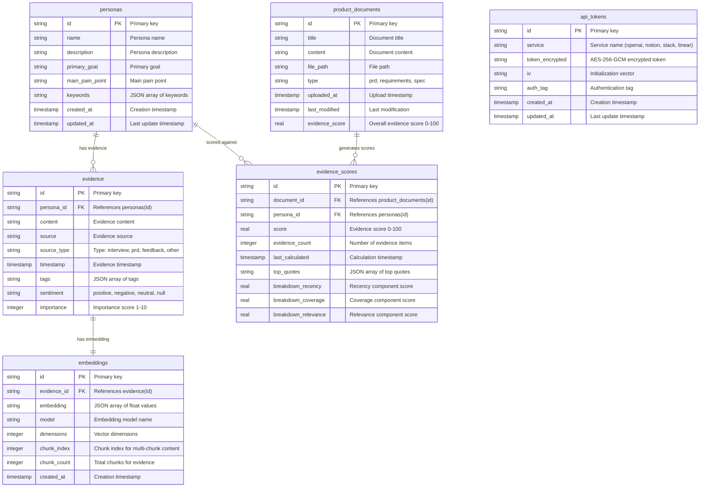

# Personyx Database Entity-Relationship Diagram

**Generated for Phase 2.4 Data Access Layer Utilities**  
**Date:** 2025-01-03  
**Schema Version:** v2.4

## Overview

The Personyx database uses SQLite with a normalized relational schema designed for persona-driven product development. The schema supports evidence collection, document analysis, vector embeddings, and evidence scoring with robust security for API tokens.

## Entity-Relationship Diagram



## Table Descriptions

### 1. `personas`

**Purpose:** Store persona definitions and characteristics.

| Column            | Type    | Constraints                         | Description                         |
| ----------------- | ------- | ----------------------------------- | ----------------------------------- |
| `id`              | TEXT    | PRIMARY KEY                         | Unique persona identifier           |
| `name`            | TEXT    | NOT NULL                            | Persona name (e.g., "Solo Founder") |
| `description`     | TEXT    | NOT NULL                            | Detailed persona description        |
| `primary_goal`    | TEXT    | NOT NULL                            | Main objective of this persona      |
| `main_pain_point` | TEXT    | NOT NULL                            | Primary challenge/pain point        |
| `keywords`        | TEXT    | NOT NULL                            | JSON array of relevant keywords     |
| `created_at`      | INTEGER | NOT NULL, DEFAULT CURRENT_TIMESTAMP | Creation timestamp                  |
| `updated_at`      | INTEGER | NOT NULL, DEFAULT CURRENT_TIMESTAMP | Last update timestamp               |

**Relationships:**

- One-to-many with `evidence` (one persona has many evidence items)
- One-to-many with `evidence_scores` (one persona scored against many documents)

### 2. `evidence`

**Purpose:** Store evidence items collected from various sources.

| Column        | Type    | Constraints           | Description                                   |
| ------------- | ------- | --------------------- | --------------------------------------------- |
| `id`          | TEXT    | PRIMARY KEY           | Unique evidence identifier                    |
| `persona_id`  | TEXT    | NOT NULL, FOREIGN KEY | References `personas(id)`                     |
| `content`     | TEXT    | NOT NULL              | Evidence content/quote                        |
| `source`      | TEXT    | NOT NULL              | Source identification                         |
| `source_type` | TEXT    | NOT NULL              | Type: 'interview', 'prd', 'feedback', 'other' |
| `timestamp`   | INTEGER | NOT NULL              | Evidence timestamp                            |
| `tags`        | TEXT    | NOT NULL              | JSON array of tags                            |
| `sentiment`   | TEXT    | NULLABLE              | 'positive', 'negative', 'neutral', or null    |
| `importance`  | INTEGER | NOT NULL              | Importance score (1-10 scale)                 |

**Relationships:**

- Many-to-one with `personas` (many evidence items belong to one persona)
- One-to-one with `embeddings` (each evidence item has one embedding)

### 3. `embeddings`

**Purpose:** Store vector embeddings for semantic similarity search.

| Column        | Type    | Constraints                         | Description                                      |
| ------------- | ------- | ----------------------------------- | ------------------------------------------------ |
| `id`          | TEXT    | PRIMARY KEY                         | Unique embedding identifier                      |
| `evidence_id` | TEXT    | NOT NULL, FOREIGN KEY               | References `evidence(id)`                        |
| `embedding`   | TEXT    | NOT NULL                            | JSON-serialized float array                      |
| `model`       | TEXT    | NOT NULL                            | Embedding model (e.g., 'text-embedding-3-small') |
| `dimensions`  | INTEGER | NOT NULL                            | Vector dimensions                                |
| `chunk_index` | INTEGER | NOT NULL                            | Chunk index for multi-chunk content              |
| `chunk_count` | INTEGER | NOT NULL                            | Total chunks for this evidence                   |
| `created_at`  | INTEGER | NOT NULL, DEFAULT CURRENT_TIMESTAMP | Creation timestamp                               |

**Relationships:**

- One-to-one with `evidence` (each embedding belongs to one evidence item)

### 4. `product_documents`

**Purpose:** Store uploaded product documents (PRDs, specs, requirements).

| Column           | Type    | Constraints                         | Description                                  |
| ---------------- | ------- | ----------------------------------- | -------------------------------------------- |
| `id`             | TEXT    | PRIMARY KEY                         | Unique document identifier                   |
| `title`          | TEXT    | NOT NULL                            | Document title                               |
| `content`        | TEXT    | NOT NULL                            | Full document content                        |
| `file_path`      | TEXT    | NULLABLE                            | Original file path                           |
| `type`           | TEXT    | NOT NULL                            | Document type: 'prd', 'requirements', 'spec' |
| `uploaded_at`    | INTEGER | NOT NULL, DEFAULT CURRENT_TIMESTAMP | Upload timestamp                             |
| `last_modified`  | INTEGER | NOT NULL, DEFAULT CURRENT_TIMESTAMP | Last modification                            |
| `evidence_score` | REAL    | NULLABLE                            | Overall evidence score (0-100)               |

**Relationships:**

- One-to-many with `evidence_scores` (one document scored against many personas)

### 5. `evidence_scores`

**Purpose:** Store calculated evidence scores for document-persona combinations.

| Column                | Type    | Constraints                         | Description                        |
| --------------------- | ------- | ----------------------------------- | ---------------------------------- |
| `id`                  | TEXT    | PRIMARY KEY                         | Unique score identifier            |
| `document_id`         | TEXT    | NOT NULL, FOREIGN KEY               | References `product_documents(id)` |
| `persona_id`          | TEXT    | NOT NULL, FOREIGN KEY               | References `personas(id)`          |
| `score`               | REAL    | NOT NULL                            | Final evidence score (0-100)       |
| `evidence_count`      | INTEGER | NOT NULL                            | Number of evidence items used      |
| `last_calculated`     | INTEGER | NOT NULL, DEFAULT CURRENT_TIMESTAMP | Calculation timestamp              |
| `top_quotes`          | TEXT    | NOT NULL                            | JSON array of top evidence quotes  |
| `breakdown_recency`   | REAL    | NOT NULL                            | Recency component score            |
| `breakdown_coverage`  | REAL    | NOT NULL                            | Coverage component score           |
| `breakdown_relevance` | REAL    | NOT NULL                            | Relevance component score          |

**Relationships:**

- Many-to-one with `product_documents` (many scores for one document)
- Many-to-one with `personas` (many scores for one persona)

### 6. `api_tokens` 🔒

**Purpose:** Securely store encrypted API tokens for external services.

| Column            | Type    | Constraints                         | Description                                         |
| ----------------- | ------- | ----------------------------------- | --------------------------------------------------- |
| `id`              | TEXT    | PRIMARY KEY                         | Unique token identifier                             |
| `service`         | TEXT    | NOT NULL                            | Service name: 'openai', 'notion', 'slack', 'linear' |
| `token_encrypted` | TEXT    | NOT NULL                            | AES-256-GCM encrypted token                         |
| `iv`              | TEXT    | NOT NULL                            | Initialization vector for AES                       |
| `auth_tag`        | TEXT    | NOT NULL                            | Authentication tag for AES-GCM                      |
| `created_at`      | INTEGER | NOT NULL, DEFAULT CURRENT_TIMESTAMP | Creation timestamp                                  |
| `updated_at`      | INTEGER | NOT NULL, DEFAULT CURRENT_TIMESTAMP | Last update timestamp                               |

**Security Features:**

- ✅ AES-256-GCM encryption with unique IVs
- ✅ Authentication tags for tamper detection
- ✅ PBKDF2 key derivation
- ✅ No plaintext token storage

## Data Flow & Relationships

### Evidence Collection Flow

1. **Personas** are defined with goals, pain points, and keywords
2. **Evidence** is collected from interviews, surveys, and feedback
3. **Embeddings** are generated for each evidence item for similarity search
4. Evidence is linked to specific personas based on relevance

### Document Analysis Flow

1. **Product Documents** (PRDs, specs) are uploaded to the system
2. **Evidence Scores** are calculated for each document-persona combination
3. Scores consider recency, coverage, and relevance of supporting evidence
4. Top quotes are extracted and stored for quick reference

### Security Layer

1. **API Tokens** are encrypted using AES-256-GCM before database storage
2. Each token has unique IV and authentication tag for security
3. TokenVault service manages encryption/decryption transparently

## Indexes & Performance

### Recommended Indexes

```sql
-- Foreign key performance
CREATE INDEX idx_evidence_persona_id ON evidence(persona_id);
CREATE INDEX idx_embeddings_evidence_id ON embeddings(evidence_id);
CREATE INDEX idx_evidence_scores_document_id ON evidence_scores(document_id);
CREATE INDEX idx_evidence_scores_persona_id ON evidence_scores(persona_id);

-- Query performance
CREATE INDEX idx_evidence_importance ON evidence(importance);
CREATE INDEX idx_evidence_timestamp ON evidence(timestamp);
CREATE INDEX idx_personas_name ON personas(name);
CREATE INDEX idx_documents_type ON product_documents(type);
CREATE INDEX idx_api_tokens_service ON api_tokens(service);
```

### Performance Characteristics

- **Personas:** Typically <100 records, fast queries
- **Evidence:** Can grow to 10,000+ records, indexed by persona_id and importance
- **Embeddings:** 1:1 with evidence, indexed by evidence_id for fast lookups
- **Documents:** Typically <1,000 records, indexed by type and upload date
- **Evidence Scores:** Matrix of documents × personas, indexed by both foreign keys
- **API Tokens:** <10 records per user, fast by service name

## Data Integrity & Constraints

### Foreign Key Constraints

- `evidence.persona_id` → `personas.id` (CASCADE DELETE)
- `embeddings.evidence_id` → `evidence.id` (CASCADE DELETE)
- `evidence_scores.document_id` → `product_documents.id` (CASCADE DELETE)
- `evidence_scores.persona_id` → `personas.id` (CASCADE DELETE)

### Data Validation

- **Personas:** Names must be unique, keywords must be valid JSON
- **Evidence:** Importance must be 1-10, sentiment must be valid enum
- **Embeddings:** Dimensions must match model specifications
- **Documents:** Type must be valid enum (prd/requirements/spec)
- **Scores:** All scores must be 0-100 range
- **API Tokens:** Service must be valid enum, encryption fields required

## Schema Evolution

### Migration Strategy

The schema uses Drizzle ORM migrations stored in `/src/main/db/migrations/`:

- `0000_common_satana.sql` - Initial schema
- `0001_narrow_virginia_dare.sql` - Added embeddings and evidence_scores

### Versioning

- **Current Version:** v2.4
- **Backward Compatibility:** Maintained through migration scripts
- **Forward Compatibility:** Reserved columns for future features

## Related Documentation

- **Repository Pattern Implementation:** `/src/main/db/repositories/`
- **Database Connection:** `/src/main/db/connection.ts`
- **Schema Definition:** `/src/main/db/schema.ts`
- **Migration Scripts:** `/src/main/db/migrations/`
- **Security Implementation:** `/src/main/security/tokenVault.ts`

---

**Note:** This ER diagram represents the current production schema as of Phase 2.4 completion. All relationships enforce referential integrity through foreign key constraints with appropriate cascade behaviors.
