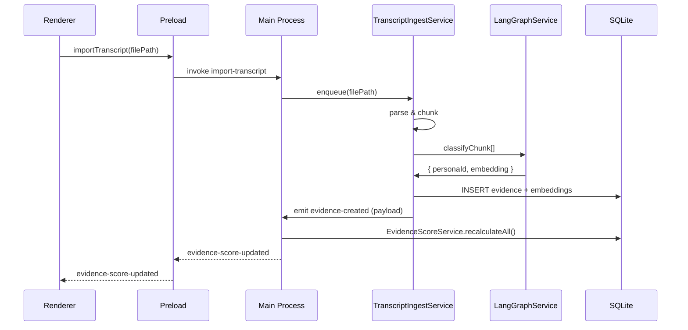

# Phase 2 – Feature 6 · Interview Evidence Generator

## 🎯 Objective

Enable Personyx to ingest user interview transcripts, extract persona-tagged evidence atoms, and update Evidence Scores automatically.

---

## 1 · Scope

1. Import markdown or plain-text transcripts placed in `/interviews` or selected via UI.
2. Parse and chunk the transcript into atomic passages (≤1 KB).
3. Classify each chunk to a persona, generate embeddings, and calculate confidence.
4. Persist evidence rows and embeddings in SQLite.
5. Recalculate Evidence Scores and broadcast `evidence-score-updated` IPC events.

---

## 2 · Architecture Overview

---

## 3 · Implementation Phases

### Phase A – Service Layer (Backend)

1. **`TranscriptIngestService.ts`**
   - Watches `/interviews` via `InterviewFolderWatcher`.
   - Exposes `importTranscript(filePath)` for manual import.
2. **Parsing**: `parseTranscript()` splits on headings or blank lines.
3. **LangGraph Classification**
   - Node A: Embedding generation (local or Firebase).
   - Node B: LLM persona-matching prompt returns `{ personaId, confidence }`.
4. **Persistence**
   - Tables: `transcripts`, `evidence`, `embeddings`.
   - Foreign keys: `evidence.transcriptId → transcripts.id`.
5. **Score Recalculation**
   - `EvidenceScoreService.recalculateAllForPersona(personaId)`.

### Phase B – IPC & Preload

- Channels: `import-transcript`, `onTranscriptImported`, `onEvidenceCreated`.
- Update `ElectronAPI` typing in `preload.ts`.

### Phase C – Renderer Enhancements

1. Re-use existing "Import Interview Transcript" modal (checklist 1.5).
2. Add toast on success; update Activity Log.

### Phase D – Testing

- **Unit**: `parseTranscript`, evidence classification mapping.
- **Integration**: `tests/test_phase_2_6_interview_ingest.mjs`.
- **E2E**: Playwright drag-and-drop transcript → evidence banner update.

---

## 4 · Deliverables

- New service files, IPC handlers, DB migrations.
- Updated UI with progress & toast.
- Tests passing in CI pipeline.
- Documentation updates (`architecture.md`, `api.md`, ER diagram).

---

## 5 · Estimated Effort

| Task                       | Owner    | Days       |
| -------------------------- | -------- | ---------- |
| Service & DB layer         | Backend  | 2          |
| Score recalculation wiring | Backend  | 0.5        |
| Unit & integration tests   | Eng Prod | 1          |
| UI tweaks & Activity Log   | Frontend | 1.5        |
| Docs & polish              | Docs     | 0.5        |
| **Total**                  | —        | **5 days** |

---

## 6 · Risks & Mitigations

| Risk                                  | Mitigation                                |
| ------------------------------------- | ----------------------------------------- |
| Large transcripts slow classification | Chunking + async queue                    |
| LLM mis-classification                | Confidence threshold + audit log          |
| DB bloat from embeddings              | Periodic prune or vector-index compaction |

---

When this feature lands, Evidence Scores will evolve continuously as fresh interview evidence arrives, closing the loop between research and product planning.
