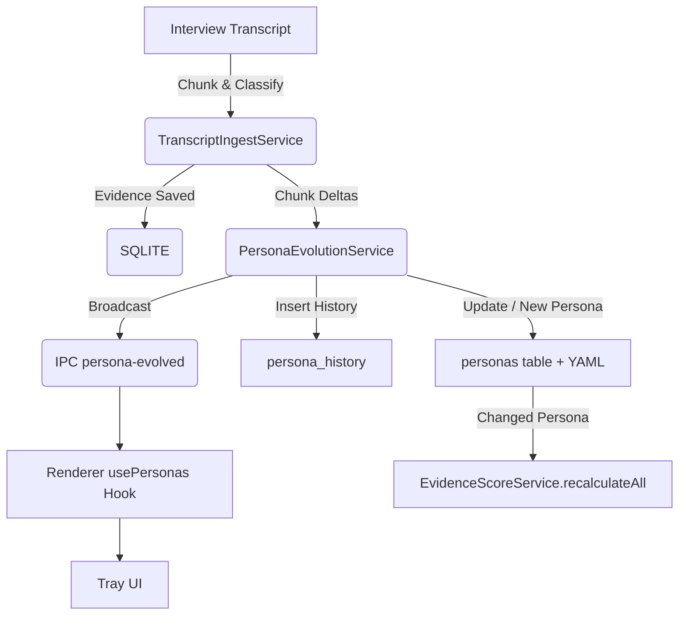

# Phase 2 Feature 7 – **Automatic Persona Evolution**

> **Objective:** Automatically detect evolving user needs in new interview transcripts and update the **persona definitions** (YAML + DB) or create new personas when confidence thresholds are met. All changes must be audited, hot-reloaded, and reflected across Evidence Scores, Activity Log, and the Tray UI.

---

## 0 · Foundation & Verification

- [ ] 0.1 **Read-only verification** – Confirm existing modules compile & tests pass (`pnpm type-check && pnpm test`).
- [ ] 0.2 **Schema review** – Validate current `personas` table, `Personas.yml`, and `PersonaLoader` sync logic.
- [ ] 0.3 **Edge-case inventory** – List transcripts that previously caused classification errors or NaN evidence scores.
- [ ] 0.4 **Baseline snapshot** – Dump existing personas to `backup/personas_YYYYMMDD.json` for rollback.

---

## 1 · Related Existing Files (📁 = already in repo)

- 📁 `src/main/services/TranscriptIngestService.ts`
- 📁 `src/main/services/WorkflowOrchestrator.ts`
- 📁 `src/main/services/PersonaManagerService.ts`
- 📁 `src/main/services/PersonaLoader.ts`
- 📁 `src/main/db/schema.ts` → `personas` table
- 📁 `src/main/db/repositories/PersonaRepo.ts`
- 📁 `src/main/services/ActivityLogService.ts`
- 📁 `src/shared/types.ts` & `src/shared/constants.ts` (IPC channels)
- 📁 `src/renderer/hooks/usePersonas.ts`
- 📁 `docs/firebase_functions_setup.md` (for Cloud option)

---

## 2 · Key Variables & Constants (🗝️ = already declared)

| Scope                        | Name                                       | Purpose                                          |
| ---------------------------- | ------------------------------------------ | ------------------------------------------------ |
| 🗝️ `TranscriptIngestService` | `CHUNK_CONFIG`                             | Splitting logic for transcript chunks            |
| 🗝️ `TranscriptIngestService` | `PROCESSING_CONFIG.minConfidenceThreshold` | Cut-off for evidence creation                    |
| **NEW**                      | `EVOLUTION_CONF.deltaThreshold`            | % similarity change that triggers persona update |
| **NEW**                      | `EVOLUTION_CONF.newPersonaThreshold`       | Confidence score to spawn a brand-new persona    |
| **NEW**                      | `EVOLUTION_CONF.maxKeywords`               | Capped keyword list length                       |
| 🗝️ `PATHS.PERSONAS_CONFIG`   | FS path to `personas.yml`                  |
| **NEW**                      | `IPC_CHANNELS.personaEvolved`              | Renderer broadcast for UI hot-reload             |

---

## 3 · Implementation Checklist

### 3.1 Database Migration

- [ ] 3.1.1 Create migration **`0003_persona_history_table.sql`** with:
  - `history_id` PK (text)
  - `persona_id` FK → `personas.id`
  - `previous_data` JSON
  - `new_data` JSON
  - `change_type` text (`"update" \| "create"`)
  - `confidence` real (0-1)
  - `timestamp` integer (Unix)
- [ ] 3.1.2 Generate Drizzle model & **`PersonaHistoryRepo.ts`**.

### 3.2 Delta Analysis Engine

- [ ] 3.2.1 Create **`DeltaAnalyzer.ts`** (pure functions):
  - `extractKeyPhrases(content: string): string[]` (LLM via `LangGraphService`)
  - `computeDiff(persona: Persona, phrases: string[]): DeltaResult`
  - Returns additive/removal sets + confidence score.
- [ ] 3.2.2 Unit-test edge cases (empty diff, low confidence, large input).

### 3.3 `PersonaEvolutionService` (NEW)

- [ ] 3.3.1 Instantiate in **`WorkflowOrchestrator`** after `TranscriptIngestService`.
- [ ] 3.3.2 Public `evolveFromTranscript(result: TranscriptIngestResult): Promise<EvolutionOutcome>`.
- [ ] 3.3.3 Uses `DeltaAnalyzer` to aggregate chunk-level deltas per persona.
- [ ] 3.3.4 Decision tree:
  1. **Update existing** if `delta.confidence ≥ deltaThreshold`.
  2. **Create new** if unmatched persona confidence ≥ `newPersonaThreshold`.
  3. **No-op** otherwise (log for analytics).
- [ ] 3.3.5 Record all changes in `persona_history` + emit IPC event.
- [ ] 3.3.6 On mutation, call `PersonaManagerService.reload()` → triggers Evidence Score recalculation.

### 3.4 Pipeline Integration

- [ ] 3.4.1 Modify **`TranscriptIngestService.persistEvidenceAndEmbeddings()`** to return per-chunk persona deltas.
- [ ] 3.4.2 After evidence save, invoke `PersonaEvolutionService.evolveFromTranscript()`.
- [ ] 3.4.3 Emit `persona-evolved` IPC event with payload `{ personaId, changeType, fieldsChanged }`.
- [ ] 3.4.4 Log activity via `ActivityLogService.logPersonaEvolved()`.

### 3.5 Renderer Updates

- [ ] 3.5.1 Update **`usePersonas`** hook to subscribe to `persona-evolved` IPC and hot-reload state.
- [ ] 3.5.2 Show toast "Persona updated ✓" using `GlobalSuccessToast`.
- [ ] 3.5.3 If new persona, prompt user to review in **`PersonaManagerModal`** (highlight badge).

### 3.6 Firebase / Cloud Option

- [ ] 3.6.1 Add Cloud Function **`suggestPersonaEvolution`** that mirrors `DeltaAnalyzer` for off-device heavy workloads.
- [ ] 3.6.2 Extend **`PersonyxCloudService`** with `getEvolutionSuggestion()` fallback.
- [ ] 3.6.3 Environment var `FIREBASE_PERSONA_EVOLUTION=enabled` toggles remote processing.
- [ ] 3.6.4 Document deployment steps in `docs/firebase_functions_setup.md`.

### 3.7 Testing & QA

- [ ] 3.7.1 Unit tests for `DeltaAnalyzer` (10+ cases).
- [ ] 3.7.2 Unit tests for `PersonaEvolutionService` decision logic.
- [ ] 3.7.3 Integration test `test_phase_2_7_persona_evolution.mjs`:
  - Import transcript → evidence → persona update → UI reload.
- [ ] 3.7.4 Manual regression: verify Evidence Score recalculation accuracy.

### 3.8 Documentation & Cleanup

- [ ] 3.8.1 Update `README.md` & `docs/file_structure.md` with new modules.
- [ ] 3.8.2 Add ER-diagram entry for `persona_history`.
- [ ] 3.8.3 Commit (`feat: implement automatic persona evolution`) – **no slashes**.
- [ ] 3.8.4 Run `pnpm lint && pnpm type-check` before commit.

---

### 🗺️ End-to-End Flow Diagram

---

> **Success Criteria:** Importing a transcript that reveals new persona insights automatically updates the persona definition, writes an audit record, recalculates evidence scores, and notifies the user – all without restarting the app.
