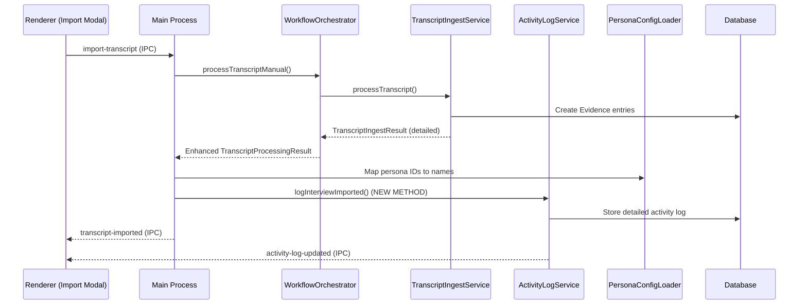

# Phase 3.1.8 - Interview Imported Activity Log Implementation Plan

## 🎯 Objective

Implement detailed activity log entries for interview transcript imports that display specific evidence counts per persona, replacing the current placeholder activity log with comprehensive persona-specific evidence information.

---

## 📋 Current State Analysis

### ✅ What Works Currently

- **Activity Log System**: Complete infrastructure with database, service, UI, and IPC events
- **Transcript Import Pipeline**: Full flow from UI → WorkflowOrchestrator → TranscriptIngestService
- **Evidence Generation**: Detailed `TranscriptIngestResult` with persona-specific evidence counts
- **Basic Activity Logging**: Placeholder entry logged in `main.ts` with incomplete data

### ❌ Current Gap

The detailed evidence counts per persona available in `TranscriptIngestResult` are not being passed back through the call chain to enable comprehensive activity logging. The current activity log entry shows:

```
"Interview transcript 'filename' processed - 0 evidence items created for 0 personas"
```

### 🎯 Target Implementation

Activity log entries should show:

```
"Interview 'agency_marketer_interview.md' imported - 5 evidence for Solo Founder, 8 evidence for Agency Marketer"
```

---

## 🏗️ Architecture Overview



---

## 📦 Implementation Phases

### **Phase A: Data Flow Enhancement**

- [ ] **A.1** Update `TranscriptProcessingResult` interface to include detailed evidence data
- [ ] **A.2** Modify `WorkflowOrchestrator.processTranscriptManual()` to return detailed results
- [ ] **A.3** Update `main.ts.handleImportTranscript()` to receive and process detailed results

### **Phase B: Activity Log Service Enhancement**

- [ ] **B.1** Create new `logInterviewImported()` method in `ActivityLogService`
- [ ] **B.2** Add persona name mapping functionality
- [ ] **B.3** Update activity log metadata interface for persona evidence details

### **Phase C: IPC Event Enhancement**

- [ ] **C.1** Update `transcript-imported` IPC event to include evidence counts
- [ ] **C.2** Enhance activity log broadcasting with detailed persona information

### **Phase D: UI Enhancement**

- [ ] **D.1** Update `ActivityLogPanel` to display detailed persona evidence counts
- [ ] **D.2** Add persona-specific metadata display in activity log entries

### **Phase E: Testing & Integration**

- [ ] **E.1** Create comprehensive unit tests for new activity logging
- [ ] **E.2** Add integration tests for the complete interview import → activity log flow
- [ ] **E.3** Manual testing verification

---

## 🔧 Detailed Implementation Steps

### **Phase A.1: Update TranscriptProcessingResult Interface**

**File**: `src/main/services/WorkflowOrchestrator.ts`

```typescript
export interface TranscriptProcessingResult {
  success: boolean;
  result?: {
    fileName: string;
    contentLength: number;
    timestamp: Date;
    // NEW: Add detailed evidence information
    evidenceCreated?: string[]; // evidence IDs
    personasAffected?: string[]; // persona IDs
    processingTime?: number; // milliseconds
    evidenceCountByPersona?: Record<string, number>; // persona ID → evidence count
  };
  error?: string;
}
```

### **Phase A.2: Enhance WorkflowOrchestrator.processTranscriptManual()**

**File**: `src/main/services/WorkflowOrchestrator.ts`

- [ ] **A.2.1** Store `TranscriptIngestResult` from `processTranscriptWithIngestService()`
- [ ] **A.2.2** Calculate evidence counts per persona from the detailed result
- [ ] **A.2.3** Return enhanced `TranscriptProcessingResult` with evidence details

```typescript
// New method to calculate evidence counts by persona
private calculateEvidenceCountsByPersona(
  evidenceIds: string[],
  personasAffected: string[]
): Promise<Record<string, number>> {
  // Query evidence table to count evidence per persona
  // Return mapping: { "solo-founder": 5, "agency-marketer": 8 }
}
```

### **Phase A.3: Update main.ts.handleImportTranscript()**

**File**: `src/main/main.ts`

- [ ] **A.3.1** Replace current basic activity logging with detailed logging
- [ ] **A.3.2** Use new `ActivityLogService.logInterviewImported()` method
- [ ] **A.3.3** Pass evidence counts and persona information to activity log

### **Phase B.1: Create ActivityLogService.logInterviewImported()**

**File**: `src/main/services/ActivityLogService.ts`

```typescript
/**
 * Log interview import with detailed persona evidence counts
 */
async logInterviewImported(
  fileName: string,
  evidenceCountByPersona: Record<string, number>,
  processingTime?: number
): Promise<ActivityLog> {
  // Get persona names for display
  const personaNames = await this.getPersonaNames(Object.keys(evidenceCountByPersona));

  // Create readable description
  const evidenceDetails = personaNames.map(persona =>
    `${evidenceCountByPersona[persona.id]} evidence for ${persona.name}`
  ).join(', ');

  const description = `Interview "${fileName}" imported - ${evidenceDetails}`;

  return this.logActivity({
    type: 'import-success',
    title: 'Interview Imported',
    description,
    source: 'transcript-import',
    metadata: {
      fileName,
      evidenceCountByPersona,
      personaNames: personaNames.map(p => ({ id: p.id, name: p.name })),
      totalEvidenceCount: Object.values(evidenceCountByPersona).reduce((sum, count) => sum + count, 0),
      personasAffectedCount: Object.keys(evidenceCountByPersona).length,
      processingTime,
      operation: 'interview-import',
    },
    timestamp: new Date(),
  });
}
```

### **Phase B.2: Add Persona Name Mapping**

**File**: `src/main/services/ActivityLogService.ts`

```typescript
/**
 * Get persona names for given persona IDs
 */
private async getPersonaNames(personaIds: string[]): Promise<Array<{id: string, name: string}>> {
  // Import PersonaRepo and get persona details
  // Return array of { id, name } for display
}
```

### **Phase B.3: Update Activity Log Metadata Interface**

**File**: `src/shared/types.ts`

```typescript
export interface ActivityLogMetadata {
  fileName?: string;
  evidenceCount?: number;
  personasAffected?: string[];
  processingTime?: number;
  errorMessage?: string;
  scores?: EvidenceScore[];
  documentId?: string;

  // NEW: Enhanced interview import metadata
  evidenceCountByPersona?: Record<string, number>;
  personaNames?: Array<{ id: string; name: string }>;
  totalEvidenceCount?: number;
  personasAffectedCount?: number;

  [key: string]: unknown;
}
```

### **Phase C.1: Update transcript-imported IPC Event**

**File**: `src/shared/types.ts`

```typescript
export interface IPCEvents {
  'transcript-imported': {
    evidenceId: string;
    personaId: string;
    content: string;
    // NEW: Add detailed evidence information
    fileName: string;
    evidenceCountByPersona: Record<string, number>;
    totalEvidenceCount: number;
    personasAffected: string[];
    processingTime: number;
  };
  // ... other events
}
```

### **Phase D.1: Enhance ActivityLogPanel UI**

**File**: `src/renderer/components/ActivityLogPanel.tsx`

- [ ] **D.1.1** Add display logic for `evidenceCountByPersona` metadata
- [ ] **D.1.2** Show persona-specific evidence counts in activity log entries
- [ ] **D.1.3** Update metadata display to handle new interview import format

```typescript
// New UI section for detailed persona evidence display
{entry.metadata?.evidenceCountByPersona && (
  <div className="mt-2 space-y-1">
    {entry.metadata.personaNames?.map((persona: {id: string, name: string}) => (
      <div key={persona.id} className="flex items-center gap-2 text-xs">
        <span className="bg-persona-100 dark:bg-persona-900/30 text-persona px-2 py-1 rounded">
          👤 {persona.name}
        </span>
        <span className="bg-slate-100 dark:bg-slate-800 px-2 py-1 rounded">
          📊 {entry.metadata.evidenceCountByPersona[persona.id]} evidence
        </span>
      </div>
    ))}
  </div>
)}
```

### **Phase E.1: Unit Tests**

**File**: `tests/test_phase_3_1_8_interview_imported_activity_log.mjs`

- [ ] **E.1.1** Test `ActivityLogService.logInterviewImported()` with various evidence counts
- [ ] **E.1.2** Test persona name mapping functionality
- [ ] **E.1.3** Test enhanced `TranscriptProcessingResult` data flow
- [ ] **E.1.4** Test activity log metadata structure and persistence

### **Phase E.2: Integration Tests**

- [ ] **E.2.1** End-to-end test: transcript import → evidence generation → activity log
- [ ] **E.2.2** Test IPC event flow with detailed evidence counts
- [ ] **E.2.3** Test UI display of enhanced activity log entries

### **Phase E.3: Manual Testing**

- [ ] **E.3.1** Import various interview transcripts and verify activity log entries
- [ ] **E.3.2** Verify persona name display and evidence count accuracy
- [ ] **E.3.3** Test activity log panel UI with new metadata display

---

## 🔗 Dependencies & Related Files

### **Core Files to Modify**

1. `src/main/services/WorkflowOrchestrator.ts` - Enhanced data flow
2. `src/main/services/ActivityLogService.ts` - New interview import logging
3. `src/main/main.ts` - Updated import handling
4. `src/shared/types.ts` - Interface updates
5. `src/renderer/components/ActivityLogPanel.tsx` - UI enhancements

### **Dependency Services**

- `PersonaConfigLoader` - For persona name mapping
- `PersonaRepo` - For persona data access
- `EvidenceRepo` - For evidence count queries (if needed)
- `TranscriptIngestService` - Source of detailed results

### **Firebase Configuration**

No Firebase configuration changes required - this feature uses existing local database and services.

---

## 🎯 Success Criteria

### **Functional Requirements**

- [ ] Activity log shows "Interview 'filename' imported - X evidence for PersonaA, Y evidence for PersonaB"
- [ ] Evidence counts accurately reflect actual evidence created per persona
- [ ] Persona names are displayed correctly (not just IDs)
- [ ] Activity log entries are immediately visible after transcript import
- [ ] UI properly displays the new metadata format

### **Technical Requirements**

- [ ] No breaking changes to existing activity log functionality
- [ ] Maintains backward compatibility with existing activity log entries
- [ ] Performance impact is minimal (persona name lookup is efficient)
- [ ] All tests pass including existing Phase 3.1.6 activity log tests

### **User Experience Requirements**

- [ ] Activity log provides clear, actionable information about interview imports
- [ ] Evidence counts help users understand which personas were most affected
- [ ] Information is displayed in a scannable, easy-to-read format

---

## 🔄 Implementation Order

1. **Start with Phase A** (Data Flow) - Foundation for detailed information
2. **Then Phase B** (Service Layer) - Core logging functionality
3. **Then Phase C** (IPC Events) - Communication layer
4. **Then Phase D** (UI) - User-facing improvements
5. **Finally Phase E** (Testing) - Verification and validation

This order ensures that data flows correctly through the system before building the user interface, and comprehensive testing validates the complete implementation.

---

## 💡 Implementation Notes

- **Persona Name Caching**: Consider caching persona names to avoid repeated database queries
- **Error Handling**: Graceful degradation if persona names can't be resolved (show IDs as fallback)
- **Performance**: The evidence count calculation should be efficient for large transcripts
- **Backwards Compatibility**: Existing activity log entries without the new metadata should still display correctly
